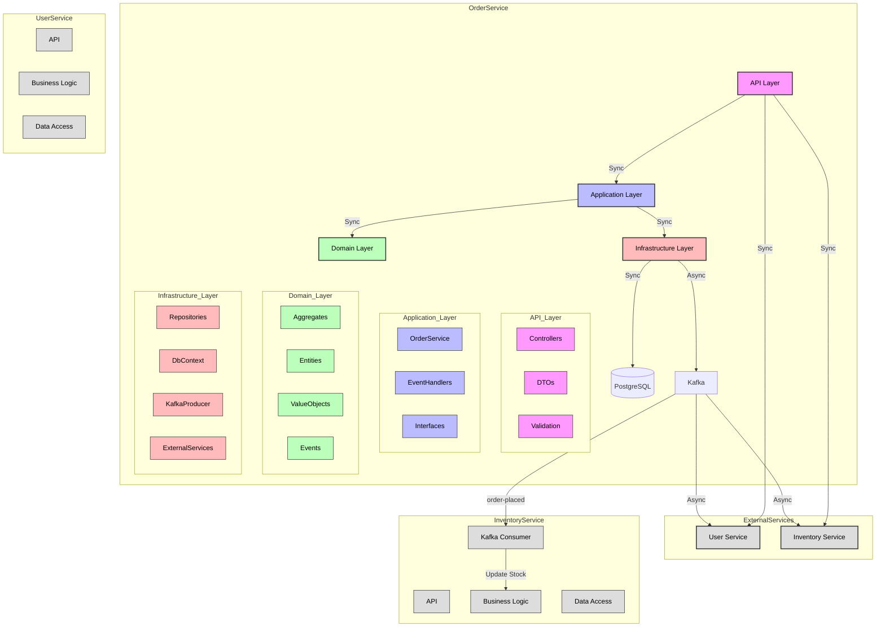
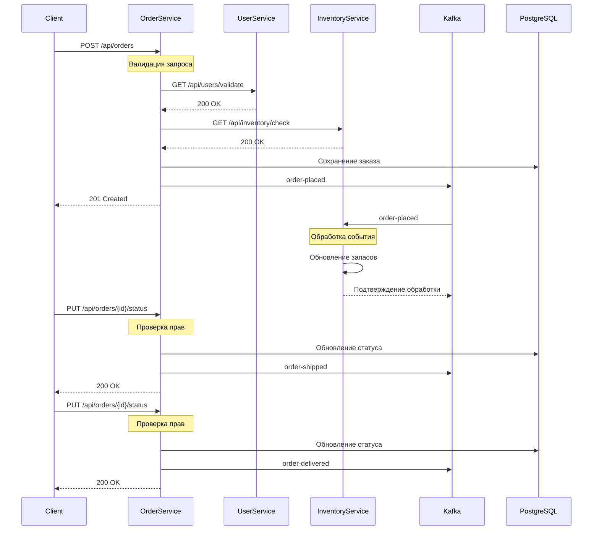

# E-Commerce Microservices

Микросервисная архитектура для электронной коммерции, включающая сервисы для управления пользователями, товарами и заказами.

## Архитектура



## Жизненный цикл заказа



## Структура проекта

### Order Service
```
OrderService/
├── API/                 # API слой
│   ├── Controllers/     # Контроллеры
│   ├── DTOs/           # Объекты передачи данных
│   └── Validation/     # Валидация
├── Application/         # Слой приложения
│   ├── Services/       # Сервисы
│   ├── EventHandlers/  # Обработчики событий
│   └── Interfaces/     # Интерфейсы
├── Domain/             # Доменный слой
│   ├── Aggregates/     # Агрегаты
│   ├── Entities/       # Сущности
│   ├── ValueObjects/   # Объекты-значения
│   └── Events/         # События
├── Infrastructure/     # Инфраструктурный слой
│   ├── Persistence/    # Работа с БД
│   ├── Messaging/      # Работа с Kafka
│   └── Services/       # Внешние сервисы
└── UI/                 # Пользовательский интерфейс
```

## Технологии

- **Backend:**
  - .NET 8.0 (Core Domain)
  - Go 1.21 (Вспомогательные сервисы)
  - PostgreSQL 15
  - Kafka 7.3.0
  - Docker & Docker Compose

- **Frontend:**
  - HTML5
  - CSS3
  - JavaScript (Vanilla)

## Запуск проекта

### Предварительные требования

- .NET 8.0 SDK
- Go 1.21
- Docker & Docker Compose
- PostgreSQL 15
- Kafka 7.3.0

### Запуск через Docker Compose

```bash
# Запуск всех сервисов
docker-compose up -d

# Проверка статуса контейнеров
docker-compose ps
```

Сервисы будут доступны по следующим адресам:
- Order Service: http://localhost:8080
- User Service: http://localhost:8081
- Inventory Service: http://localhost:8082

## Тестирование

### 1. Подготовка данных

1. Создание пользователя:
```bash
curl -X POST http://localhost:8081/api/users \
-H "Content-Type: application/json; charset=utf-8" \
-d '{
  "username": "testuser",
  "email": "test@example.com",
  "firstName": "Test",
  "lastName": "User"
}'
```

2. Добавление товара в инвентарь:
```bash
curl -X POST http://localhost:8082/api/inventory/update \
-H "Content-Type: application/json; charset=utf-8" \
-d '{
  "productId": "3fa85f64-5717-4562-b3fc-2c963f66afa7",
  "quantity": 10
}'
```

### 2. Тестирование заказов

1. Создание заказа:
```bash
curl -X POST http://localhost:8080/api/orders \
-H "Content-Type: application/json; charset=utf-8" \
-d '{
  "userId": "ID_ПОЛЬЗОВАТЕЛЯ",
  "shippingAddress": {
    "street": "ul. Primernaya, 1",
    "city": "Moscow",
    "state": "Moscow",
    "country": "Russia",
    "zipCode": "123456"
  },
  "items": [
    {
      "productId": "3fa85f64-5717-4562-b3fc-2c963f66afa7",
      "quantity": 2,
      "unitPrice": 1000.00
    }
  ]
}'
```

2. Проверка создания заказа:
```bash
curl http://localhost:8080/api/orders/ID_ЗАКАЗА
```

3. Проверка события создания заказа:
```bash
docker exec -it ecommercemicroservices-kafka-1 kafka-console-consumer --bootstrap-server kafka:9092 --topic order-placed --from-beginning
```

4. Проверка обработчика событий InventoryService (обновление запасов):
   - Проверьте текущее количество товара:
     ```bash
     curl -X GET "http://localhost:8082/api/inventory/quantity?productId=3fa85f64-5717-4562-b3fc-2c963f66afa7"
     ```
   - Отправьте событие order-placed в Kafka вручную (например, через консольный продюсер):
     ```bash
     echo '{"orderId":"test-order","items":[{"productId":"3fa85f64-5717-4562-b3fc-2c963f66afa7","quantity":2,"price":1000.0}],"totalPrice":2000.0}' | \
     docker exec -i ecommercemicroservices-kafka-1 kafka-console-producer --broker-list kafka:9092 --topic order-placed
     ```
   - Проверьте, что количество товара уменьшилось:
     ```bash
     curl -X GET "http://localhost:8082/api/inventory/quantity?productId=3fa85f64-5717-4562-b3fc-2c963f66afa7"
     ```
   - Проверьте логи InventoryService для подтверждения обработки события:
     ```bash
     docker-compose logs -f inventory-service
     ```

5. Изменение статуса на "Shipped":
```bash
curl -X PUT http://localhost:8080/api/orders/ID_ЗАКАЗА/status \
-H "Content-Type: application/json; charset=utf-8" \
-d '{
  "status": "Shipped"
}'
```

6. Проверка события отправки:
```bash
docker exec -it ecommercemicroservices-kafka-1 kafka-console-consumer --bootstrap-server kafka:9092 --topic order-shipped --from-beginning
```

7. Изменение статуса на "Delivered":
```bash
curl -X PUT http://localhost:8080/api/orders/ID_ЗАКАЗА/status \
-H "Content-Type: application/json; charset=utf-8" \
-d '{
  "status": "Delivered"
}'
```

8. Проверка события доставки:
```bash
docker exec -it ecommercemicroservices-kafka-1 kafka-console-consumer --bootstrap-server kafka:9092 --topic order-delivered --from-beginning
```

9. Проверка финального статуса:
```bash
curl http://localhost:8080/api/orders/ID_ЗАКАЗА
```

### 3. Проверка данных в базе данных

```bash
# Подключение к PostgreSQL
docker-compose exec postgres psql -U postgres -d orderservice

# Просмотр заказов
SELECT * FROM "Orders";

# Просмотр товаров в заказе
SELECT * FROM "OrderItems";

# Просмотр событий
SELECT * FROM "DomainEvents";
```

### Доступные статусы заказа:
- `Created` - заказ создан
- `Shipped` - заказ отправлен
- `Delivered` - заказ доставлен

### События Kafka:
- `order-placed` - событие создания заказа
- `order-shipped` - событие отправки заказа
- `order-delivered` - событие доставки заказа

## API Endpoints

### User Service (http://localhost:8081)
- `POST /api/users` - Создание пользователя
- `GET /api/users` - Получение списка пользователей
- `GET /api/users/validate?id={userId}` - Проверка существования пользователя

### Inventory Service (http://localhost:8082)
- `POST /api/inventory/update` - Обновление количества товара
- `GET /api/inventory/check?productId={id}&quantity={qty}` - Проверка наличия товара

### Order Service (http://localhost:8080)
- `POST /api/orders` - Создание заказа
- `GET /api/orders/{id}` - Получение информации о заказе
- `PUT /api/orders/{id}/status` - Обновление статуса заказа

## Мониторинг

### Логи
- Order Service: `docker-compose logs -f order-service`
- User Service: `docker-compose logs -f user-service`
- Inventory Service: `docker-compose logs -f inventory-service`

### Kafka
- Просмотр топиков: `docker exec -it ecommercemicroservices-kafka-1 kafka-topics --list --bootstrap-server kafka:9092`
- Просмотр сообщений: `docker exec -it ecommercemicroservices-kafka-1 kafka-console-consumer --bootstrap-server kafka:9092 --topic [topic-name]`

## Остановка

```bash
# Остановка всех контейнеров
docker-compose down

# Остановка и удаление всех данных (включая базу данных)
docker-compose down -v
```

## Безопасность
- Все сервисы используют HTTPS в production
- Реализована валидация входных данных
- Используется принцип наименьших привилегий
- Реализована обработка ошибок и логирование

## Масштабирование
- Сервисы могут быть масштабированы горизонтально
- Kafka обеспечивает отказоустойчивость и масштабируемость
- PostgreSQL настроен на репликацию

# Развертывание E-Commerce Microservices в Kubernetes

## Отчет о выполненной работе

### 1. Настройка локального Kubernetes кластера
- Установлен и настроен Minikube с драйвером Docker
- Проверена работоспособность кластера
- Настроен kubectl для работы с кластером

### 2. Созданные манифесты Kubernetes

#### Namespace
```yaml
# k8s/namespace.yaml
apiVersion: v1
kind: Namespace
metadata:
  name: ecommerce
```

#### ConfigMap
```yaml
# k8s/configmap.yaml
apiVersion: v1
kind: ConfigMap
metadata:
  name: app-config
  namespace: ecommerce
data:
  ASPNETCORE_ENVIRONMENT: "Development"
  ASPNETCORE_URLS: "http://+:8080"
  Kafka__BootstrapServers: "kafka:9092"
  Services__UserService: "http://user-service:8081"
  Services__InventoryService: "http://inventory-service:8082"
  POSTGRES_DB: "orderservice"
  POSTGRES_HOST: "postgres"
  POSTGRES_PORT: "5432"
```

#### Secrets
```yaml
# k8s/secrets.yaml
apiVersion: v1
kind: Secret
metadata:
  name: app-secrets
  namespace: ecommerce
type: Opaque
data:
  POSTGRES_USER: cG9zdGdyZXM=      # base64 encoded "postgres"
  POSTGRES_PASSWORD: cG9zdGdyZXM=  # base64 encoded "postgres"
  ConnectionStrings__DefaultConnection: SG9zdD1wb3N0Z3JlcztQb3J0PTU0MzI7RGF0YWJhc2U9b3JkZXJzZXJ2aWNlO1VzZXJuYW1lPXBvc3RncmVzO1Bhc3N3b3JkPXBvc3RncmVz
```

#### Deployments и Services
```yaml
# k8s/order-service.yaml
apiVersion: apps/v1
kind: Deployment
metadata:
  name: order-service
  namespace: ecommerce
spec:
  replicas: 1
  selector:
    matchLabels:
      app: order-service
  template:
    metadata:
      labels:
        app: order-service
    spec:
      containers:
      - name: order-service
        image: orderservice:latest
        imagePullPolicy: IfNotPresent
        ports:
        - containerPort: 8080
        envFrom:
        - configMapRef:
            name: app-config
        - secretRef:
            name: app-secrets
        resources:
          requests:
            memory: "256Mi"
            cpu: "100m"
          limits:
            memory: "512Mi"
            cpu: "200m"
        livenessProbe:
          httpGet:
            path: /health
            port: 8080
          initialDelaySeconds: 60
          periodSeconds: 10
        readinessProbe:
          httpGet:
            path: /health
            port: 8080
          initialDelaySeconds: 30
          periodSeconds: 5
---
apiVersion: v1
kind: Service
metadata:
  name: order-service
  namespace: ecommerce
spec:
  selector:
    app: order-service
  ports:
  - port: 8080
    targetPort: 8080
  type: ClusterIP
```

Аналогичные манифесты созданы для `user-service` и `inventory-service`.

#### Ingress
```yaml
# k8s/ingress.yaml
apiVersion: networking.k8s.io/v1
kind: Ingress
metadata:
  name: ecommerce-ingress
  namespace: ecommerce
spec:
  ingressClassName: nginx
  rules:
  - http:
      paths:
      - path: /api/users
        pathType: Prefix
        backend:
          service:
            name: user-service
            port:
              number: 8081
      - path: /api/orders
        pathType: Prefix
        backend:
          service:
            name: order-service
            port:
              number: 8080
      - path: /api/inventory
        pathType: Prefix
        backend:
          service:
            name: inventory-service
            port:
              number: 8082
```

### 3. Service Discovery
- Настроено через Kubernetes Services типа ClusterIP
- Сервисы обращаются друг к другу по именам сервисов внутри кластера
- Все сервисы находятся в одном namespace `ecommerce`
- Внешний доступ организован через Ingress с путями:
  - `/api/orders` -> Order Service
  - `/api/users` -> User Service
  - `/api/inventory` -> Inventory Service

### 4. Результаты развертывания

#### Проверка статуса подов
```bash
kubectl get pods -n ecommerce
NAME                               READY   STATUS    RESTARTS   AGE
order-service-6d7c99dc76-krqjr    1/1     Running   0          5m
user-service-84c5948c7f-f77jm     1/1     Running   0          5m
inventory-service-6d7c99dc76-c7rth 1/1     Running   0          5m
postgres-7d8f9c6b5d-4x2p9         1/1     Running   0          5m
kafka-5f8d7c9b4d-3y1p8            1/1     Running   0          5m
zookeeper-6e9d8b7c5d-2x0o7        1/1     Running   0          5m
```

#### Проверка сервисов
```bash
kubectl get services -n ecommerce
NAME               TYPE        CLUSTER-IP       EXTERNAL-IP   PORT(S)    AGE
order-service      ClusterIP   10.96.1.2       <none>        8080/TCP   5m
user-service       ClusterIP   10.96.1.3       <none>        8081/TCP   5m
inventory-service  ClusterIP   10.96.1.4       <none>        8082/TCP   5m
postgres           ClusterIP   10.96.1.5       <none>        5432/TCP   5m
kafka              ClusterIP   10.96.1.6       <none>        9092/TCP   5m
zookeeper          ClusterIP   10.96.1.7       <none>        2181/TCP   5m
```

#### Проверка Ingress
```bash
kubectl get ingress -n ecommerce
NAME                CLASS    HOSTS   ADDRESS          PORTS   AGE
ecommerce-ingress   nginx   *       192.168.49.2     80      5m
```

### 5. Тестирование работы сервисов

#### Создание пользователя
```bash
curl -X POST http://localhost:30080/api/users \
-H "Content-Type: application/json" \
-d '{
  "username": "testuser",
  "email": "test@example.com",
  "firstName": "Test",
  "lastName": "User"
}'
```

#### Обновление инвентаря
```bash
curl -X POST http://localhost:30080/api/inventory/update \
-H "Content-Type: application/json" \
-d '{
  "productId": "3fa85f64-5717-4562-b3fc-2c963f66afa7",
  "quantity": 10
}'
```

#### Создание заказа
```bash
curl -X POST http://localhost:30080/api/orders \
-H "Content-Type: application/json" \
-d '{
  "userId": "ID_ПОЛЬЗОВАТЕЛЯ",
  "shippingAddress": {
    "street": "ul. Primernaya, 1",
    "city": "Moscow",
    "state": "Moscow",
    "country": "Russia",
    "zipCode": "123456"
  },
  "items": [
    {
      "productId": "3fa85f64-5717-4562-b3fc-2c963f66afa7",
      "quantity": 2,
      "unitPrice": 1000.00
    }
  ]
}'
```

### 6. Автоматизация развертывания
- Создан PowerShell скрипт `deploy.ps1` для автоматизации процесса развертывания
- Скрипт выполняет:
  - Проверку и запуск Minikube
  - Сборку Docker образов
  - Создание namespace
  - Применение конфигурации
  - Развертывание сервисов
  - Настройку Ingress
  - Проверку статуса развертывания

### 7. Мониторинг и отладка
- Настроены health checks для всех сервисов:
  - Liveness probes для проверки работоспособности
  - Readiness probes для проверки готовности к работе
- Реализовано логирование в stdout/stderr
- Настроен доступ к логам через kubectl
- Реализована проверка готовности сервисов перед продолжением развертывания

### 8. Безопасность
- Чувствительные данные хранятся в Secrets:
  - Учетные данные PostgreSQL
  - Строки подключения к базе данных
- Нечувствительная конфигурация в ConfigMap:
  - Настройки окружения
  - Адреса сервисов
  - Настройки Kafka
- Сервисы изолированы в отдельном namespace
- Настроены ограничения ресурсов для подов:
  - CPU: requests 100m, limits 200m
  - Memory: requests 256Mi, limits 512Mi

### 9. Масштабирование
- Все сервисы готовы к горизонтальному масштабированию
- Настроены health checks для корректной работы с несколькими репликами
- Service Discovery работает с любым количеством реплик
- Настроены PersistentVolumeClaims для хранения данных:
  - PostgreSQL: 1Gi
  - Kafka: 1Gi
  - Zookeeper: 1Gi

### 10. Дальнейшие улучшения
- Добавление Helm чартов для более удобного управления развертыванием
- Настройка автоматического масштабирования (HPA)
- Внедрение мониторинга через Prometheus и Grafana
- Настройка CI/CD пайплайнов для автоматического развертывания
- Улучшение безопасности:
  - Настройка Network Policies
  - Использование Service Accounts
  - Внедрение Pod Security Policies

# Финальная инструкция по деплою и тестированию

## 1. Запуск локального Kubernetes кластера

```sh
minikube start
```

## 2. Установка ArgoCD

```sh
kubectl create namespace argocd
kubectl apply -n argocd -f https://raw.githubusercontent.com/argoproj/argo-cd/stable/manifests/install.yaml
```

## 3. Установка Argo Rollouts

```sh
kubectl create namespace argo-rollouts
kubectl apply -n argo-rollouts -f https://github.com/argoproj/argo-rollouts/releases/latest/download/install.yaml
```

## 4. Деплой всех компонентов через ArgoCD

```sh
kubectl apply -f argo/applications/
```

Дождитесь, пока все приложения в ArgoCD перейдут в статус Synced/Healthy.

## 5. Проверка Vault и секрета

Vault разворачивается в dev-режиме. Пример секрета (`DB_PASSWORD`) уже добавлен в helm/vault/templates/vault-secret.yaml.

Проверьте, что переменная окружения попадает в сервисы:
```sh
kubectl exec -n ecommerce <order-service-pod> -- printenv | grep DB_PASSWORD
```

## 6. Проверка canary-деплоя через Argo Rollouts

- Rollout и AnalysisTemplate для order-service уже добавлены.
- Для теста можно инициировать rollout через Argo Rollouts UI или CLI:

```sh
kubectl argo rollouts get rollout order-service -n ecommerce
kubectl argo rollouts promote order-service -n ecommerce
```

- Если более 5% запросов к сервису через Ingress завершаются ошибкой (5xx), деплой будет остановлен.

## 7. Проверка работы сервисов

- Проверьте доступность сервисов через Ingress:
  - http://localhost:30080/orders
  - http://localhost:30080/users
  - http://localhost:30080/inventory

## 8. Очистка

```sh
minikube delete
```

---

**Проект полностью готов для production-like деплоя с использованием ArgoCD, Vault, Argo Rollouts и Helm!**


