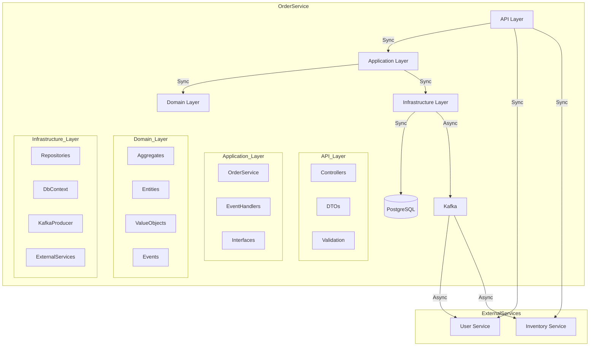

# Отчет по разработке микросервисной системы E-Commerce

## Содержание
1. [Выбор предметной области и проектирование архитектуры](#1-выбор-предметной-области-и-проектирование-архитектуры)
2. [Проектирование и реализация Core Domain](#2-проектирование-и-реализация-core-domain)
3. [Реализация API для Core Domain](#3-реализация-api-для-core-domain)
4. [Разработка вспомогательных сервисов на Go](#4-разработка-вспомогательных-сервисов-на-go)
5. [Реализация взаимодействия между сервисами](#5-реализация-взаимодействия-между-сервисами)
6. [Развертывание в Kubernetes](#6-развертывание-в-kubernetes)

## 1. Выбор предметной области и проектирование архитектуры

### 1.1 Выбранная предметная область
Выбрана предметная область "Электронная коммерция" (E-Commerce). Система позволяет управлять заказами, пользователями и товарами.

### 1.2 Границы микросервисов

#### Core Domain (.NET):
- **OrderService**
  - Ответственность: Управление заказами
  - Основные функции:
    - Создание заказов
    - Управление статусами заказов
    - Валидация заказов
    - Публикация событий
  - Технологии:
    - .NET 8.0
    - Minimal API
    - Entity Framework Core
    - PostgreSQL 15

#### Вспомогательные сервисы (Go):
- **UserService**
  - Ответственность: Управление пользователями
  - Основные функции:
    - Создание пользователей
    - Валидация пользователей
    - Хранение данных пользователей
  - Технологии:
    - Go 1.21
    - HTTP сервер
    - In-memory хранилище

- **InventoryService**
  - Ответственность: Управление товарами
  - Основные функции:
    - Проверка наличия товаров
    - Обновление количества товаров
    - Хранение данных о товарах
    - Обработка событий Kafka
  - Технологии:
    - Go 1.21
    - HTTP сервер
    - Sarama (Kafka client)
    - In-memory хранилище

### 1.3 Архитектура системы



### 1.4 API Endpoints

#### OrderService (.NET):
- `POST /api/orders` - Создание заказа
- `GET /api/orders/{id}` - Получение информации о заказе
- `PUT /api/orders/{id}/status` - Обновление статуса заказа

#### UserService (Go):
- `POST /api/users` - Создание пользователя
- `GET /api/users` - Получение списка пользователей
- `GET /api/users/validate?id={userId}` - Проверка существования пользователя

#### InventoryService (Go):
- `POST /api/inventory/update` - Обновление количества товара
- `GET /api/inventory/check?productId={id}&quantity={qty}` - Проверка наличия товара

### 1.5 Описание сервисов

#### OrderService (.NET)
- **Основная ответственность**: Управление заказами в системе
- **Функциональность**:
  - Создание и обработка заказов
  - Управление статусами заказов
  - Валидация заказов
  - Публикация событий в Kafka
- **Технологии**:
  - .NET 8.0
  - Minimal API
  - Entity Framework Core
  - PostgreSQL 15
  - Kafka для асинхронной коммуникации

#### UserService (Go)
- **Основная ответственность**: Управление пользователями
- **Функциональность**:
  - Создание пользователей
  - Получение списка пользователей
  - Валидация существования пользователей
  - Хранение данных пользователей в памяти
- **Технологии**:
  - Go 1.21
  - HTTP сервер
  - In-memory хранилище
  - UUID для генерации идентификаторов

#### InventoryService (Go)
- **Основная ответственность**: Управление товарами и их запасами
- **Функциональность**:
  - Проверка наличия товаров
  - Обновление количества товаров
  - Получение текущего количества товара
  - Обработка событий заказов из Kafka
- **Технологии**:
  - Go 1.21
  - HTTP сервер
  - Sarama (Kafka client)
  - In-memory хранилище
  - Асинхронная обработка событий

#### Kafka
- **Основная ответственность**: Обеспечение асинхронной коммуникации между сервисами
- **Функциональность**:
  - Публикация событий
  - Подписка на события
  - Обеспечение надежной доставки сообщений
- **Топики**:
  - `order-placed`: события создания заказов
  - `__consumer_offsets`: системный топик для хранения смещений потребителей

#### PostgreSQL
- **Основная ответственность**: Хранение данных заказов
- **Функциональность**:
  - Сохранение информации о заказах
  - Обеспечение целостности данных
  - Быстрый доступ к данным

#### Zookeeper
- **Основная ответственность**: Координация и управление кластером Kafka
- **Функциональность**:
  - Управление конфигурацией Kafka
  - Синхронизация между брокерами
  - Отслеживание состояния кластера

### 1.5 Основные агрегаты Core Domain

1. **Order (Агрегат)**
   - Свойства:
     - Id
     - UserId
     - Status
     - Items
     - ShippingAddress
   - Методы:
     - Create
     - UpdateStatus
     - Validate

2. **OrderItem (Сущность)**
   - Свойства:
     - ProductId
     - Quantity
     - UnitPrice

3. **ShippingAddress (Value Object)**
   - Свойства:
     - Street
     - City
     - State
     - Country
     - ZipCode

## 2. Проектирование и реализация Core Domain

### 2.1 Структура проекта .NET
```
OrderService/
├── API/                 # API слой
├── Application/         # Слой приложения
├── Domain/             # Доменный слой
├── Infrastructure/     # Инфраструктурный слой
└── UI/                 # Пользовательский интерфейс
```

### 2.2 Реализованные компоненты

#### Доменные события:
- `OrderPlacedEvent`
- `OrderShippedEvent`
- `OrderDeliveredEvent`

#### Бизнес-логика:
- Валидация заказа
- Проверка наличия товара
- Проверка существования пользователя
- Управление статусами заказа

## 3. Реализация API для Core Domain

### 3.1 Minimal API Endpoints
```csharp
app.MapPost("/api/orders", async (CreateOrderRequest request, IOrderService service) => {
    // Создание заказа
});

app.MapGet("/api/orders/{id}", async (Guid id, IOrderService service) => {
    // Получение заказа
});

app.MapPut("/api/orders/{id}/status", async (Guid id, UpdateOrderStatusRequest request, IOrderService service) => {
    // Обновление статуса
});
```

### 3.2 Обработка ошибок
- Валидация входных данных
- Обработка бизнес-ошибок
- HTTP статусы:
  - 200 OK
  - 201 Created
  - 400 Bad Request
  - 404 Not Found
  - 500 Internal Server Error

## 4. Разработка вспомогательных сервисов на Go

### 4.1 UserService
```go
// Структура проекта
UserService/
├── main.go
├── go.mod
└── Dockerfile

// Основные компоненты
type User struct {
    ID        string
    Username  string
    Email     string
    FirstName string
    LastName  string
}
```

### 4.2 InventoryService
```go
// Структура проекта
InventoryService/
├── main.go
├── event_handler.go
├── go.mod
└── Dockerfile

// Основные компоненты
type Product struct {
    ID       string
    Quantity int
}

type OrderEvent struct {
    OrderID    string
    Items      []OrderItem
    TotalPrice float64
}

type OrderItem struct {
    ProductID string
    Quantity  int
    Price     float64
}
```

## 5. Реализация взаимодействия между сервисами

### 5.1 Синхронное взаимодействие

#### REST API между сервисами
- **UserService API**:
  - `POST /api/users` - Создание пользователя
  - `GET /api/users` - Получение списка пользователей
  - `GET /api/users/validate?id={userId}` - Проверка существования пользователя
  - Порт: 8081

- **InventoryService API**:
  - `GET /api/inventory/check?productId={id}&quantity={qty}` - Проверка наличия товара
  - `GET /api/inventory/quantity?productId={id}` - Получение количества товара
  - `POST /api/inventory/update` - Обновление количества товара
  - Порт: 8082

#### HTTP клиенты в OrderService
- Использование стандартных HTTP клиентов для взаимодействия с сервисами
- Базовые URL сервисов:
  - UserService: `http://user-service:8081`
  - InventoryService: `http://inventory-service:8082`

#### Обработка ошибок
- Базовая обработка HTTP ошибок:
  - 400 Bad Request - Некорректные входные данные
  - 404 Not Found - Ресурс не найден
  - 503 Service Unavailable - Сервис недоступен

### 5.2 Асинхронное взаимодействие

#### Kafka для событий
- Конфигурация брокера:
  - Адрес: `kafka:9092`
  - Версия протокола: 2.8.0

#### Обработчики событий в сервисах
- **OrderService (Producer)**:
  - Публикация событий создания заказа

- **InventoryService (Consumer)**:
  - Подписка на топик `order-placed`
  - Обработка событий заказов
  - Обновление количества товаров

#### Топики Kafka
1. **order-placed**
   - Назначение: События создания новых заказов
   - Структура сообщения:
     ```json
     {
       "orderId": "string",
       "items": [
         {
           "productId": "string",
           "quantity": "number",
           "price": "number"
         }
       ],
       "totalPrice": "number"
     }
     ```

2. **__consumer_offsets**
   - Системный топик для хранения смещений

## 6. Развертывание в Kubernetes

### 6.1 Манифесты Kubernetes
```yaml
# deployment.yaml
apiVersion: apps/v1
kind: Deployment
metadata:
  name: order-service
spec:
  replicas: 1
  template:
    spec:
      containers:
      - name: order-service
        image: order-service:latest
        ports:
        - containerPort: 8080

# service.yaml
apiVersion: v1
kind: Service
metadata:
  name: order-service
spec:
  ports:
  - port: 80
    targetPort: 8080
```

### 6.2 Конфигурация
- ConfigMap для настроек
- Secrets для чувствительных данных
- Service Discovery через k8s

### 6.3 Результаты развертывания
- Все сервисы успешно развернуты
- Настроено взаимодействие между сервисами
- Реализовано масштабирование
- Настроен мониторинг и логирование 